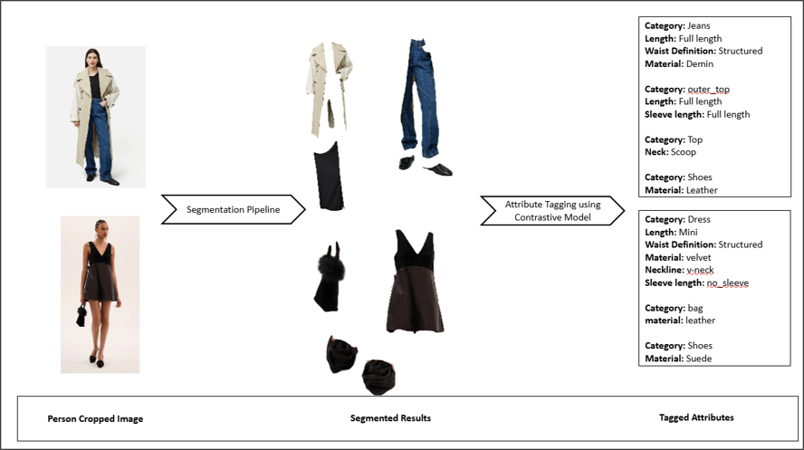

# FashionAttributeExtractor

This project builds a multi-staged pipeline using pretrained models to extract Fashion Attribute Information from real-world ecommerce images. The project is built in collaboration with a commercial company as a part of Dissertation for fullfilment of MSc. The multi-staged pipeline contains **Segmentation** and **Tagging** components which takes images as input and perfoms isolating the garment items from multi-object images and use each garment items mask to perform attribute tagging. We established from the literature review that the models chosen must be fashion-aware to be able to understand the fashion vocabulary. 

As part of the project, we use the multi-object fashion images to isolate each garment items and then perform fine-grained attribute tagging. Each isolated garment items are coarsely labelled using the output from Segmentation step. Using this coarsely labelled category names, they are routed to first predict fine-grained cattegories like Pants are routed to predict if they belong to Jeans, Trousers or Shorts whereas Skirts which are standalone labelled output from segmentation is directly passed to extract the fine-grained attributes like length, silhouette, cut, material, colour etc... 

The project is scoped for 7 major fashion categories which has 10 subcategories in total

| **Category** | **Example Garment Items** |
| --- | --- |
| **Bag** | Hubo, Wallet, Purse |
| **Dress** | Maxi, Mini, Jumpsuit, Rompers |
| **Pants**  | Jeans, Shorts, Trousers |
| **Tops** | T-Shirt, Shirt, Blouse |
| **Shoes** | Boots, Sandals |
| **Skirt** | Mini, Midi, Maxi |
| **Outer Top** | Jacket, Cardigan |


---
- **Segmentation:** This component is responsible for isolating garments from multi-garment images. We analyse three different architectures where we use a semantic human parser model, closed-set object detector and an open-vocabulary object detector paired with foundational segmentation model Segment Anything model

    - Semantic Segmentation - [Semantic Model](https://huggingface.co/mattmdjaga/segformer_b2_clothes) Hybrid model paired with closed-set object detector to detect layered garments.
    - Closed-set Object Detector with SAM - [YOLOS based](https://huggingface.co/valentinafevu/yolos-fashionpedia) + SAM2.1-large
    - Open-Vocabulary Object Detector with SAM - [Grounded DINO](https://huggingface.co/IDEA-Research/grounding-dino-base) SAM2.1-large

The segmentation pipeline takes input image, using YOLO crops the person from image. Then using the chosen segmentation pipeline architecture processes the cropped image to split the multi-garment image in to separate isolated garments. Each image outputs multiple garment items present in image that are scoped into a tight cropped garment mask, a contextual background image where garment is maintained at 100% brightness and rest contexts at 25% brightness, a full background image where garment is maintained at full background is maintained at 25% brightness and a greyscale mask used for evaluation. 

- **Tagging:** This component is used to extract the fine-grained attributes like neckline, sleeve length, length, material etc... As established from literature, the attributes are category-dependent. Hence, we define the attribute lists with its set of attribute values valid to that category in [data](/data) folder. To tag attributes we compare two models

    - FashionCLIP - [FashionCLIP](https://huggingface.co/patrickjohncyh/fashion-clip)
    - FashionSigLip - [FashionSigLip](https://huggingface.co/Marqo/marqo-fashionSigLIP)

Finally the attributes are then saved in CSV format.

---
### Steps to Run the Code

1. Run the pip install to install all the dependent packages using requirements.txt
2. Update the config file to locations for input images, output paths and evaluation ground truth file paths (if running evaluation)
3. Update main.py with pipeline to be executed with values **PIPELINE_A** or **PIPELINE_B** or **PIPELINE_C** separately or as a comma separated list if running all the three segmentation pipelines
4. Trigger main.py using the input parameters to trigger end-to-end process to run the segmentation step and tagging step.
5. The final structures attributes is saved in respective folders as specified in the config.   

--- 
- Create a virtual environment for installing packages (Optional) But the packages needs to be installed in main python installation if venv is skipped
```
python -m venv .venv
```

- Activate the virtual environment created
```
.\.venv\Scripts\activate
```

- Install all packages required using the below command
```
pip.exe install -r .\requirements.txt
```

- Navigate to root directory
```
cd .\FashionAttributeExtractor\
```

- Update the config files for all the paths required - Input images folder, output location paths.
- Change the pipeline that needs to be executed. Currently it is using Hybrib SegFormer pipeline which was found to be best for detection and tagging.
- Run the python command to trigger the attribute extraction

```
python .\main.py
```
---
### Sample Process



[Segmentation Pipeline Flowcharts](SEGMENTATION_TAGGING_PIPELINE.md)

---
Folder Structure

```
FashionAttributeExtractor                           # Main Project folder
 |- data/                                           # Data files for taxonomy, mapping etc...
 | |- attributes_list.py                            
 | |- colour_mapping.json
 | |- prompt.json
 | |- prompt_description.json
 | |- taxonomy_hierarchy_config.json
 |--- evaluation/                                   # Code to run evaluation against ground truth
 | |--- attribute_f1.py
 | |--- attribute_results_visualise.py
 | |--- colour_evaluation.py
 | |--- Evaluate_box_IoU.py
 | |--- Evaluate_IoU.py
 | |--- preprocessing_results_visualise.py
 | |--- segmentation_results_visualise.py
 |--- modules/                                      # Main source folder that runs the modules
 | |--- Attribute_tagging/                          # Attribute tagging code 
 | | |--- clip.py
 | | |--- color_tagging.py
 | |--- DINO/                                       # Code to run Grounding DINO + SAM
 | | |--- DINO.py                                   
 | |--- Segformer/                                  # Code to run SegFormer based models
 | | |--- base_segmenter.py
 | | |--- segformer_factory.py
 | | |--- segmenter.py
 | | |--- segmenter_all.py
 | |--- objects_detector_separator.py               # Code to run YOLOS model
 | |--- person_detector.py
 |--- utils/                                        # All utils like log, create folder, configurations
 | |--- calculate_conf.py
 | |--- create_folders.py
 | |--- evaluation_config.py
 | |--- log_config.py
 | |--- pipeline_config.py
 | |--- timer.py
 |--- attribute_results.py                          # Main code to trigger attribute results
 |--- box_evaluation.py                             # Code to trigger box evaluation 
 |--- colour_evaluation.py                          # Code to trigger colour evaluation
 |--- colour_tuning.py                              # Code to trigger k-means cluster to find best K for colour
 |--- config.py                                     # Main configuration files that define all the paths and constants used
 |--- main.py                                       # Main file that triggers pipeline
 |--- main_evaluation.py                            # Evaluation file to evaluate the output of segmentation step
 |--- preprocessing_results.py                      # Main file to evaluate image preprocessing outputs
 |--- README.md                                     
 |--- requirements.txt                              # Prerequisites to be installed before running code
 |--- SQL_Work.ipynb                                # SQL analysis performed
 |--- tagging.py                                    # Main code to trigger tagging
 |--- tagging_evaluation.py                         # Main code to trigger tagging evaluation
 |--- visualise.py                                  # Code to visualise the results of segmentation step
```

---
### Model Usage

- All the models used here are hosted on Hugging Face Hub and code to load and draw inference from models are used as shown in the respective model page on HuggingFace and is noted as comments "Code similar to <<SOURCE>> or Code adapted from <<SOURCE>>".
- To load the ground truth attribute labels provided by company we adapted the single starter script provided by them to fix errors and align the script modules to run on local machine. The script is just to load the loosely labelled attributes for ground truth dataset to PostgreSQL and is not added to this repository as it is private to commercial company. However, it contained JSON file with list of attributes defined in key:value pairs and the script to load was created using SQLAlchemy following the SQLAlchemy documentation.
- AI was used as a tool to learn complex concepts and debugging tool for understanding errors. The prompt sused while development is added in prompts.docx file. The code that was adapted from AI is noted with comment "Code adapted with AI" 
